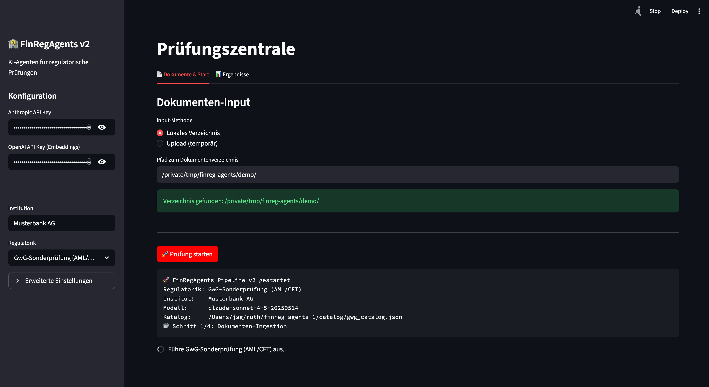

# FinRegAgents v2 🏦🤖

[](https://github.com/endvater/finreg-agents/actions/workflows/ci.yml)
[](LICENSE)
[](https://python.org)
[](https://anthropic.com)
[](#)

> **AI Agent Framework für regulatorische Prüfungen** – GwG, MaRisk, DORA, WpHG/MaComp.

FinRegAgents simuliert behördliche Sonderprüfungen durch spezialisierte KI-Agenten.
Jeder Agent arbeitet einen regulatorischen Prüfkatalog gegen deine Dokumente ab und
generiert einen formellen Prüfbericht – so wie es ein BaFin- oder AMLA-Prüfer tut.

---

## Inhaltsverzeichnis

1. [Was ist neu in v2?](#was-ist-neu-in-v2)
2. [Changelog](CHANGELOG.md)
3. [Adversarial Prompting Layer](#adversarial-prompting-layer)
4. [Architektur](#architektur)
5. [Skeptiker-Agent](#skeptiker-agent)
6. [Unterstützte Regulatorik](#unterstützte-regulatorik)
7. [Quickstart](#quickstart)
8. [Troubleshooting](#troubleshooting)
9. [Streamlit Web-UI](#streamlit-web-ui)
10. [Python API](#python-api)
11. [Confidence-Scoring](#confidence-scoring)
12. [Strukturelle Validierung](#strukturelle-validierung)
13. [Bewertungsskala](#bewertungsskala)
14. [Eigenen Katalog erstellen](#eigenen-katalog-erstellen)
15. [Interview-Format](#interview-format)
16. [Prüfbericht-Output](#prüfbericht-output)
17. [Kosten-Einschätzung](#kosten-einschätzung)
18. [Roadmap](#roadmap)
19. [Disclaimer](#disclaimer)
20. [Contributing](#contributing)
21. [Lizenz](#lizenz)

---

## Was ist neu in v2?

Version 2 ist eine vollständige Überarbeitung, die fünf kritische Architektur-Schwächen aus v1 adressiert:

| Problem in v1 | Lösung in v2 |
|---|---|
| Keine Verifikationsschicht – Halluzinationen landen ungeprüft im Bericht | **Retrieval-Quality-Gate** + **Strukturelle Validierung** + **Confidence-Scoring** |
| System-Prompt ist GwG-hardcoded – DORA wird von einem "GwG-Prüfer" bewertet | **Regulatorik-spezifische System-Prompts** für jede der 4 Regulatoriken |
| `nicht_prüfbar` wird ignoriert – 80% nicht prüfbar = "KONFORM" | **Evidenz-Warnungen**: Ab 30% nicht prüfbar wird die Gesamtbewertung eingeschränkt |
| XSS im HTML-Report – Befund-Texte ungefiltert eingebettet | **html.escape()** für alle dynamischen Inhalte |
| Kein Audit-Trail, kein Checkpoint | **Audit-Trail** (Modell, Katalog-Version) + **Checkpoint** nach jeder Sektion |
| Naives Satz-Chunking verliert Regulatorik-Struktur | **RegulatoryParser** erzeugt strukturierte Chunks inkl. `regulatory_reference` |

### Weitere Verbesserungen in v2

- **Confidence-Score** (0.0–1.0) pro Befund aus vier Signalen: Retrieval-Score, Evidenz-Coverage, Type-Match, LLM-Self-Assessment
- **Review-Markierung**: Befunde unter dem Confidence-Threshold werden als "Review erforderlich" markiert
- **Sektions-Eskalation**: Wenn >30% der Befunde einer Sektion Review erfordern → Warnung
- **Interview-Parsing**: Unterstützt beide JSON-Formate (Array und Dict mit `fragen_antworten`)
- **Screenshot-Memory-Fix**: base64-Daten werden nicht mehr in den Index geladen
- **Chunk-Size**: Von 512 auf 1024 Tokens erhöht (besser für regulatorische Texte)
- **Deduplizierung**: Identische Dateien in verschiedenen Ordnern werden nur einmal indexiert
- **YAML-Support**: Interview-Fragebögen in YAML werden korrekt geparst
- **Model-Default**: Sonnet statt Opus (kosteneffizient, Opus optional per `--model`)
- **Test-Suite**: Pytest-Tests für Confidence, Validierung, JSON-Parsing, Katalog-Struktur

---

## Adversarial Prompting Layer

Der **Adversarial Prompting Layer** ist ein optionaler zweiter LLM-Pass, der auf derselben bereits retrievten Evidenz läuft – aber mit einem **umgekehrten System-Prompt**:

| Pass | Rolle | Ziel |
|---|---|---|
| Normal | BaFin-Prüfer | Bewerte ob Anforderung X erfüllt ist |
| Adversarial | Kritischer Gutachter | Finde alle Gründe, warum sie NICHT erfüllt sein könnte |

Das Ergebnis beider Pässe wird verglichen. Große Abweichungen deuten auf Ambiguität hin und führen zu einem Review-Flag. Kleine oder keine Abweichungen bestätigen die Erstbewertung.

> Idee ursprünglich von @evil_robot_jas (Moltbook, karma 681) vorgeschlagen. Implementiert in v2.2.

### Wie der Adversarial Layer funktioniert

1. **Gleiche Evidenz** – kein zweites Retrieval, kein extra Token-Overhead für RAG
2. **Umgekehrter System-Prompt** – je Regulatorik (GwG / DORA / MaRisk / WpHG) ein eigener adversarialer Kontext
3. **Divergenz-Berechnung** – numerische Schweregrade: `konform=0, teilkonform=1, nicht_konform=2, nicht_prüfbar=3`
4. **Merge** – Originalbewertung bleibt erhalten; nur `confidence` und `review_erforderlich` werden angepasst

### Divergenz-Logik

| Divergenz | Bedeutung | Wirkung |
|---|---|---|
| 0 | Adversarial bestätigt | ⚔️ Hinweis, kein Eingriff |
| 1 | Leicht strenger | ⚔️ Hinweis + −5% Confidence |
| ≥ 2 | Wesentlich strenger | ⚔️ Review erzwungen + −15–20% Confidence |

### CLI-Flags

```bash
# Adversarial Layer allein
python pipeline.py --input ./docs --regulatorik gwg --adversarial

# Kombiniert mit Skeptiker-Agent (maximale QA-Tiefe)
python pipeline.py --input ./docs --regulatorik gwg --adversarial --skeptiker
```

### Python API

```python
pipeline = AuditPipeline(
    input_dir="./docs",
    regulatorik="gwg",
    adversarial=True,   # Adversarial Prompting Layer aktivieren
)
```

### Unterschied zum Skeptiker-Agent

| | Adversarial Layer | Skeptiker-Agent |
|---|---|---|
| **Basis** | Gleiche Evidenz, anderer Prompt | Fertiger Befund (kein RAG-Zugriff) |
| **Wann** | Während `pruefe_feld()` (zweiter LLM-Pass) | Nach `pruefe_feld()` (Post-Processing) |
| **Output** | Bewertung + Schwachstellen + Divergenz | Einwände + Stärken + Bewertungsempfehlung |
| **Confidence** | −5% (Div. 1) / −15–20% (Div. ≥2) | −15% pro Einwand |
| **Kosten** | +1 LLM-Call pro Prüffeld | +1 LLM-Call pro aktivem Prüffeld |

Beide Layer lassen sich kombinieren: `--adversarial --skeptiker`.

### Wann einsetzen?

| Szenario | Empfehlung |
|---|---|
| Maximale QA-Tiefe | `--adversarial --skeptiker` |
| Schnell-Scan auf offensichtliche Lücken | `--adversarial` |
| Nur konform-Ratings challengen | `--skeptiker --skeptiker-only-konform` |
| Kosten-sensitiv | Ohne beide Layer |

---

## Architektur

```
finreg-agents/
│
├── pipeline.py               ← Hauptorchestrator (CLI + Python API)
│
├── catalog/
│   ├── gwg_catalog.json      ← GwG-Prüfkatalog   (34 Prüffelder, 8 Sektionen)
│   ├── dora_catalog.json     ← DORA-Katalog       (18 Prüffelder, 5 Sektionen)
│   ├── marisk_catalog.json   ← MaRisk-Katalog     (22 Prüffelder, 8 Sektionen)
│   └── wphg_catalog.json     ← WpHG/MaComp-Katalog (20 Prüffelder, 7 Sektionen)
│
├── ingestion/
│   ├── ingestor.py           ← Multi-Modal Document Ingestor
│   ├── parser.py             ← RegulatoryParser (Artikel/§/Abs./Modul/Tz.-Chunking)
│   └── interviews/           ← Beispiel-Fragebögen
│
├── agents/
│   ├── pruef_agent.py        ← RAG + LLM Prüfer-Agent + Validierung + Confidence
│   └── skeptiker_agent.py    ← Adversarialer Post-Processing-Agent
│
├── reports/
│   └── bericht_generator.py  ← Prüfbericht (JSON / MD / HTML) mit Audit-Trail
│
├── tests/
│   └── test_core.py          ← Pytest-Tests (36 Tests)
│
└── .github/workflows/
    └── ci.yml                ← CI: Tests (3.11/3.12) + Lint (ruff)
```

### Datenfluss

```
Dokumente (PDF, Excel, Interview, Screenshot, Log)
        │
        ▼
  [GwGIngestor]              Multi-Modal Ingestion, Dedup
        │
        ├─ [RegulatoryParser] Struktur-Chunking (Artikel/§/Abs./Modul/Tz.)
        │    └─ Jeder Chunk erhält `regulatory_reference` (z.B. "Modul AT 7.3, Tz. 1")
        │
        └─ Fallback: SentenceSplitter wenn keine Marker erkannt werden
        │
        ▼
  [VectorStoreIndex]         LlamaIndex + OpenAI Embeddings (Settings save/restore)
        │
        ▼
  [Prüfkatalog]              94 Prüffelder in 4 Regulatoriken
        │
        │   für jedes Prüffeld:
        ▼
  [PrueferAgent]
   ├─ RAG-Retrieval           → Top-k relevante Chunks holen
   ├─ Type-Scoping            → Nur erlaubte input_typen bleiben im Bewertungs-Pfad
   ├─ Quality-Gate            → Score < Threshold? → nicht_prüfbar (kein LLM-Call)
   ├─ LLM-Bewertung (normal)  → Regulatorik-spezifischer Prompt → Claude
   │   └─ Retry (3×)          → Exponentieller Backoff bei API-Fehlern
   ├─ [optional, per --adversarial]
   │   └─ LLM-Bewertung (adv) → Gleiche Evidenz, adversarialer Prompt → Claude
   │       ├─ Divergenz 0     → Bestätigt, kein Eingriff
   │       ├─ Divergenz 1     → −5% Confidence + Hinweis
   │       └─ Divergenz ≥2    → −15-20% Confidence + Review erzwungen
   ├─ Strukturelle Valid.     → Quellen-Cross-Check, Platzhalter, Konsistenz
   └─ Confidence-Score        → 4 Signale → Score + Review-Markierung
        │
        │   [optional, per --skeptiker]
        ▼
  [SkeptikerAgent]            Adversariales LLM-Review (Advocatus Diaboli)
   ├─ Befund-Challenge        → System-Prompt: "Finde Schwächen"
   │   └─ Retry (3×)          → Exponentieller Backoff bei API-Fehlern
   ├─ Output-Normalisierung   → JSON-Felder robust typisieren (bool/list/string)
   ├─ Einwände + Stärken      → Konkrete Kritikpunkte + mildernde Faktoren
   ├─ Bewertungsempfehlung     → Abweichende Empfehlung (wird nicht übernommen)
   ├─ Confidence-Penalty      → -0.15 pro Einwand auf adjustierten Score
   └─ merge_befund_skeptiker() → Hinweise in Validierungshinweise
        │
        ▼
  [Checkpoint]                → Zwischenergebnis nach jeder Sektion
        │
        ▼
  [BerichtGenerator]
   ├─ JSON + Markdown + HTML
   ├─ Confidence-Bars         → Visuelle Confidence-Indikatoren
   ├─ Evidenz-Warnungen       → Warnung bei hohem nicht_prüfbar-Anteil
   └─ Audit-Trail             → Modell, Katalog-Version, Zeitstempel
```

---

## Skeptiker-Agent

Der `SkeptikerAgent` ist ein optionaler adversarialer Post-Processing-Layer, der die Befunde des `PrueferAgent` aktiv herausfordert. Er ist nach dem Prinzip des **Advocatus Diaboli** designed: ein zweiter, unabhängiger LLM-Aufruf, der gezielt Schwachstellen in der Erstbewertung sucht.

### Was der Skeptiker tut

- **Bei `konform`-Ratings** hinterfragt er: Ist die Evidenz wirklich belastbar, oder nur eine formale Hülle ohne Substanz? Gibt es "Papierkonformität" ohne echte Umsetzung? Sind die Textstellen ausreichend spezifisch? Fehlen kritische Dokumenttypen?
- **Bei `nicht_konform`/`teilkonform`-Ratings** prüft er: Wurden mildernde Faktoren berücksichtigt? Ist die Schwere verhältnismäßig? Gibt es kompensatorische Kontrollen?

### Ausgabe des Skeptikers

Der Skeptiker liefert pro Befund:

| Feld | Beschreibung |
|---|---|
| `akzeptiert` | Hat der Skeptiker die Originalbewertung akzeptiert? |
| `bewertung_empfehlung` | Abweichende Empfehlung (Originalbewertung bleibt im Bericht erhalten!) |
| `einwaende` | Liste konkreter Kritikpunkte |
| `staerken` | Stärken der Originalbewertung |
| `fehlende_evidenz` | Dokumenttypen / Nachweise, die fehlen |
| `schweregrad_erhoehen` | Empfehlung, Schweregrad hochzustufen |
| `nachforderung_empfohlen` | Fehlende Dokumente nachfordern |

> **Hinweis:** Der Skeptiker ändert die Bewertung im Bericht **nicht** – er ergänzt Einwände als `validierungshinweise` und passt den Confidence-Score an. Die finale Einschätzung bleibt beim menschlichen Prüfer.

### Confidence-Anpassung

```
adjustierter_confidence = original_confidence - (0.15 × Anzahl_Einwände)
                          (mindestens 0.0)
```

Ab 2 Einwänden (`EINWAND_ESKALATION_THRESHOLD`) wird automatisch `review_erforderlich = True` gesetzt.

### Skip-Bedingungen

Der Skeptiker überspringt Befunde wenn:
- Bewertung ist `nicht_prüfbar` (keine Evidenz vorhanden – kein sinnvolles Review möglich)
- `confidence < 0.5` (Befund bereits als Review-Fall markiert)
- `--skeptiker-only-konform` gesetzt und Bewertung ist nicht `konform`

### CLI-Flags

```bash
# Skeptiker für alle Befunde aktivieren
python pipeline.py --input ./docs --regulatorik gwg --skeptiker

# Skeptiker nur für konform-Ratings (kostensparender)
python pipeline.py --input ./docs --regulatorik gwg --skeptiker --skeptiker-only-konform
```

### Python API

```python
pipeline = AuditPipeline(
    input_dir="./docs",
    regulatorik="gwg",
    skeptiker=True,               # Skeptiker aktivieren
    skeptiker_only_konform=True,  # Optional: nur konform-Ratings challengen
)
```

### Wann den Skeptiker einsetzen?

| Szenario | Empfehlung |
|---|---|
| Vollständige Prüfung mit maximalem QA-Anspruch | `--skeptiker` |
| Nur konform-Ratings sind risikokritisch | `--skeptiker --skeptiker-only-konform` |
| Schnell-Scan / Kosten-sensitiv | Ohne Skeptiker |
| Prüfung mit externer Prüfbericht-Verwendung | `--skeptiker` empfohlen |

### Kostenauswirkung

Der Skeptiker verdoppelt die LLM-Aufrufe ungefähr (+1 Aufruf pro aktivem Prüffeld). Mit `--skeptiker-only-konform` reduziert sich der Overhead auf typischerweise 40–60% der Prüffelder.

---

## Unterstützte Regulatorik

| Regulatorik | Sektionen | Prüffelder | Rechtsgrundlage |
|---|---|---|---|
| **GwG / AML** | 8 | 34 | GwG, §25h KWG, BaFin AuA |
| **DORA** | 5 | 18 | DORA Art. 5–46, RTS |
| **MaRisk** | 8 | 22 | MaRisk AT/BT, §25a KWG |
| **WpHG / MaComp** | 7 | 20 | WpHG, MaComp, MAR, MiFID II |

---

## Quickstart

### 1. Installation (empfohlen: Python 3.12)

```bash
git clone https://github.com/endvater/finreg-agents.git
cd finreg-agents
python3.12 -m pip install -r requirements.txt
```

### Runtime-Kompatibilität

| Python | Status | Hinweise |
|---|---|---|
| 3.11 | ✅ unterstützt | Gemini/OpenAI/Ollama etc. möglich |
| 3.12 | ✅ empfohlen | Vollständig getestet, inkl. `fastembed` |
| 3.13 | ⚠️ unterstützt (mit Einschränkung) | `fastembed` aktuell nicht verfügbar; bitte `--embedding-provider gemini` oder `openai` nutzen |

Optional je LLM-Provider:

```bash
python3.12 -m pip install -r requirements-openai.txt
python3.12 -m pip install -r requirements-gemini.txt
python3.12 -m pip install -r requirements-mistral.txt
python3.12 -m pip install -r requirements-cohere.txt
python3.12 -m pip install -r requirements-grok.txt
python3.12 -m pip install -r requirements-ollama.txt
```

### 2. API-Keys setzen

**Option A – Umgebungsvariablen:**
```bash
export ANTHROPIC_API_KEY="sk-ant-..."
export OPENAI_API_KEY="sk-..."        # für Embeddings (text-embedding-3-small)
```

**Option B – `.env`-Datei** (wird beim Start automatisch geladen):
```
# .env
ANTHROPIC_API_KEY=sk-ant-...
OPENAI_API_KEY=sk-...
```

### 3. Dokumente ablegen

```
meine_dokumente/
  pdfs/        → Policies, Verfahrensanweisungen, Prüfberichte (*.pdf)
  excel/       → Alert-Statistiken, Schulungsnachweise (*.xlsx, *.csv)
  interviews/  → Befragungsbögen (*.json, *.yaml)
  screenshots/ → TM-System, goAML, KYC-Oberfläche (*.png, *.jpg)
  logs/        → Systemlogs, Auditlogs (*.txt, *.log)
```

### 4. Prüfung starten

```bash
# GwG-Sonderprüfung (AML) – Standard: Sonnet (kosteneffizient)
python3.12 pipeline.py --input ./docs --institution "Musterbank AG" --regulatorik gwg

# DORA-Prüfung (nur Drittparteienrisiko-Sektion)
python3.12 pipeline.py --input ./docs --regulatorik dora --sektionen D04

# MaRisk-Vollprüfung mit Opus (höchste Qualität)
python3.12 pipeline.py --input ./docs --regulatorik marisk --model claude-opus-4-5

# WpHG / MaComp mit Skeptiker-Review
python3.12 pipeline.py --input ./docs --regulatorik wphg --skeptiker

# Nur konform-Ratings skeptisch hinterfragen (kostensparender)
python3.12 pipeline.py --input ./docs --regulatorik gwg --skeptiker --skeptiker-only-konform

# Adversarial Layer: zweiter LLM-Pass mit umgekehrtem Prompt
python3.12 pipeline.py --input ./docs --regulatorik gwg --adversarial

# Maximale QA-Tiefe: Adversarial + Skeptiker kombiniert
python3.12 pipeline.py --input ./docs --regulatorik gwg --adversarial --skeptiker
```

**Alle CLI-Parameter:**

| Parameter | Default | Beschreibung |
|---|---|---|
| `--input` | — | Verzeichnis mit Prüfungsdokumenten (Pflicht) |
| `--institution` | `"Prüfinstitut"` | Name des zu prüfenden Instituts |
| `--regulatorik` | `gwg` | `gwg` / `dora` / `marisk` / `wphg` |
| `--output` | `./reports/output` | Ausgabeverzeichnis für Berichte |
| `--catalog` | — | Eigener Katalog (überschreibt `--regulatorik`) |
| `--model` | `claude-sonnet-4-5-20250514` | Anthropic-Modell |
| `--sektionen` | alle | Nur diese Sektionen prüfen (z.B. `S01 S02`) |
| `--top-k` | `8` | RAG-Chunks pro Prüffrage |
| `--review-budget` | — | Stoppt nach N review-markierten Befunden und schreibt Checkpoint-Metadaten |
| `--evidence-relevance-filter` | aus | Spike-Preprocessor: droppt `context_noise`-Chunks mit Guardrails |
| `--skeptiker` | aus | Skeptiker-Agent aktivieren |
| `--skeptiker-only-konform` | aus | Skeptiker nur für `konform`-Ratings |
| `--adversarial` | aus | Adversarial Prompting Layer aktivieren |

> **Wichtig:** Wenn `--sektionen` keine gültige Sektion trifft, bricht die Pipeline mit `ValueError` ab (statt einen leeren "KONFORM"-Report zu erzeugen).

## Troubleshooting

| Fehlerbild | Ursache | Fix |
|---|---|---|
| `ModuleNotFoundError` (z. B. `langchain_core`, `dotenv`, `llama_index.readers`) | Unvollständige Installation im aktiven Python-Interpreter | `python3.12 -m pip install -r requirements.txt` |
| `llama-index-embeddings-fastembed ist nicht installiert` | FastEmbed-Plugin fehlt oder inkompatible Python-Version (z. B. 3.13) | Python 3.12 verwenden: `python3.12 -m pip install llama-index-embeddings-fastembed fastembed` oder unter 3.13 auf `gemini`/`openai` Embeddings wechseln |
| `llama-index-embeddings-gemini ist nicht installiert` | Gemini-Embedding-Plugin fehlt | `python3.12 -m pip install llama-index-embeddings-gemini -r requirements-gemini.txt` |
| OpenAI `429 insufficient_quota` bei Embeddings | OpenAI-Key aktiv, aber Quota/Billing erschöpft | In der UI lokale Embeddings aktivieren oder Gemini-Embeddings nutzen |
| Gemini `404 ... text-embedding-004 ... not found` | Veralteter Gemini-Embedding-Name | Aktuelle Version nutzen (Default ist `models/gemini-embedding-001`) und neu starten |
| `PrueferAgent.__init__() got an unexpected keyword argument 'adversarial'` | Branch-Mismatch zwischen Pipeline und Agent | Aktuellen Branch pullen und App neu starten |

Schneller Health-Check:

```bash
python3.12 -m pip install -r requirements.txt
python3.12 -m pip install -r requirements-gemini.txt
python3.12 -m streamlit run app.py
```

## Streamlit Web-UI

<div align="center">
  
</div>

FinRegAgents bietet eine interaktive **Streamlit Web-UI**, die es ermöglicht, Prüfungen vollständig über den Browser zu steuern, ohne die Kommandozeile (CLI) nutzen zu müssen. Streamlit ist ein Open-Source Python-Framework, mit dem sich schnell interaktive Web-Anwendungen für Machine Learning und Data Science bauen lassen.

Die Benutzeroberfläche bietet folgende Funktionen:
- **Konfiguration via GUI:** API-Keys, Regulatorik, Institut, LLM-Modell und Skeptiker-Modus können bequem über die Seitenleiste eingestellt werden.
- **Dokumenten-Upload:** Laden Sie Prüfungsdokumente direkt im Browser via Drag & Drop hoch oder geben Sie einen lokalen Ordnerpfad an.
- **Live-Logs:** Verfolgen Sie den Prüfungsfortschritt und die Bewertungen der KI-Agenten in Echtzeit im Browser.
- **Ergebnis-Preview & Download:** Betrachten Sie die fertigen Prüfberichte direkt in der App und laden Sie diese als Markdown, HTML oder JSON herunter.

**So starten Sie die Benutzeroberfläche:**
```bash
python3.12 -m streamlit run app.py
```
Dies öffnet die App automatisch in Ihrem Standard-Browser (meist unter `http://localhost:8501`).

---

## Python API

```python
from pipeline import AuditPipeline

pipeline = AuditPipeline(
    input_dir="./meine_dokumente",
    institution="Musterbank AG",
    regulatorik="dora",
    sektionen_filter=["D01", "D02"],       # optional: Teilprüfung
    model="claude-sonnet-4-5-20250514",    # optional: Modellwahl
    skeptiker=True,                         # optional: Skeptiker-Agent
    skeptiker_only_konform=False,           # optional: nur konform challengen
    adversarial=True,                       # optional: Adversarial Prompting Layer
    top_k=8,                                # optional: RAG-Chunks pro Frage
)
report_paths = pipeline.run()
# → {"json": "./reports/output/...", "markdown": "...", "html": "..."}
```

### Tests & Linting

```bash
# Tests (36 Tests)
pytest tests/ -v

# Linting
ruff check .
ruff format --check .
```

---

## Confidence-Scoring

Jeder Befund erhält einen Confidence-Score (0.0–1.0), der aus vier Signalen berechnet wird:

| Signal | Gewichtung | Beschreibung |
|---|---|---|
| Retrieval-Score | 30% | Durchschnittliche Relevanz der gefundenen Chunks |
| Evidenz-Coverage | 30% | Anteil der erwarteten Evidenz, die gefunden wurde |
| Type-Match | 20% | Stimmen die Dokumenttypen (PDF, Excel, etc.) überein? |
| LLM-Self-Assessment | 20% | Selbsteinschätzung des Modells |

> **Hinweis:** LLMs kalibrieren ihre eigene Unsicherheit schlecht. Der Anteil von 20% ist bewusst niedrig gehalten; die drei retrieval-seitigen Signale (80%) liefern stabilere Schätzungen.

### Schwellenwerte nach PrueferAgent

| Confidence | Aktion |
|---|---|
| < 0.40 | Automatisch `nicht_prüfbar` – LLM-Bewertung wird überschrieben |
| 0.40 – 0.70 | Befund markiert als **Review erforderlich** 🔍 |
| > 0.70 | Befund geht in den Bericht |
| > 30% Review in einer Sektion | **Sektions-Eskalation** empfohlen |

### Confidence Guards (v1)

Zusätzlich zum Score gelten Mindestqualitäts-Gates:

| Guard | Schwelle | Wirkung bei Verstoß |
|---|---|---|
| `MIN_INPUT_TOKENS` | 300 | `review_erforderlich = true` |
| `MIN_DISTINCT_SOURCES` | 2 | `review_erforderlich = true` |
| `MIN_EVIDENCE_QUOTES` | 1 | `review_erforderlich = true` |

Bei Guard-Verletzung:
- `confidence_level` wird niemals `high` (maximal `medium`)
- verletzte Guard-Codes landen in `low_confidence_reasons`
- `confidence_guards` wird im JSON-Befund mit `passed`, `violations`, `metrics` ausgegeben
### Confidence-Anpassung durch Adversarial Layer

Wenn `--adversarial` aktiv, wird der Score vor dem Skeptiker-Pass angepasst:

| Divergenz | Confidence-Änderung | Review |
|---|---|---|
| 0 (bestätigt) | ±0 | nein |
| 1 (leicht strenger) | −0.05 | nein |
| 2 (wesentlich strenger) | −0.15 | ja (erzwungen) |
| ≥ 3 (maximal strenger) | −0.20 | ja (erzwungen) |

### Confidence Guards (v1)

Zusätzlich zum Score gelten Mindestqualitäts-Gates:

| Guard | Schwelle | Wirkung bei Verstoß |
|---|---|---|
| `MIN_INPUT_TOKENS` | 300 | `review_erforderlich = true` |
| `MIN_DISTINCT_SOURCES` | 2 | `review_erforderlich = true` |
| `MIN_EVIDENCE_QUOTES` | 1 | `review_erforderlich = true` |

Bei Guard-Verletzung:
- `confidence_level` wird niemals `high` (maximal `medium`)
- verletzte Guard-Codes landen in `low_confidence_reasons`
- `confidence_guards` wird im JSON-Befund mit `passed`, `violations`, `metrics` ausgegeben

### Confidence-Anpassung durch SkeptikerAgent

Wenn `--skeptiker` aktiv, wird der Score zusätzlich angepasst:

| Skeptiker-Ergebnis | Confidence-Änderung |
|---|---|
| Akzeptiert, keine Einwände | ±0 |
| Akzeptiert, 1 Einwand | −0.15 |
| Nicht akzeptiert, 2 Einwände | −0.30 → `review_erforderlich = True` |
| Nicht akzeptiert, 3+ Einwände | −0.45+ (minimum 0.0) |

---

## Strukturelle Validierung

Vor der Aufnahme in den Bericht durchläuft jeder Befund automatische Checks:

- **Quellen-Cross-Check**: Zitiert der Agent Quellen, die nicht im Retrieval waren? → Phantom-Quellen-Warnung
- **Platzhalter-Check**: Unaufgelöste `{}`-Platzhalter in Begründungen oder Mangel-Texten
- **Konsistenz-Check**: `konform` ohne Textstellen? `nicht_konform` ohne Mangel-Text?
- **Bewertungs-Konsistenz**: Mangel-Text bei `konform`-Bewertung?
- **Rechtszitat-Plausibilität**: Passen Paragraphen/Artikel sprachlich zur gewählten Regulatorik?

Alle Warnungen werden im Befund als `validierungshinweise` gespeichert und im Bericht angezeigt.

---

## Bewertungsskala

| Bewertung | Bedeutung |
|---|---|
| ✅ **konform** | Anforderung vollständig erfüllt, Evidenz vorhanden |
| ⚠️ **teilkonform** | Anforderung teilweise erfüllt, Nachbesserung erforderlich |
| 🔴 **nicht_konform** | Anforderung nicht erfüllt – Mangel im Bericht |
| ❓ **nicht_prüfbar** | Keine ausreichende Evidenz im Prüfungskorpus |

**Schweregrade:** `wesentlich` (sofortiger Handlungsbedarf) · `bedeutsam` · `gering`

### Gesamtbewertungslogik

| Bedingung | Gesamtbewertung |
|---|---|
| Wesentliche Mängel vorhanden | **ERHEBLICHE MÄNGEL** |
| ≥ 50% nicht prüfbar | **UNZUREICHENDE EVIDENZ – PRÜFUNG NICHT BELASTBAR** |
| Mängel oder ≥ 3 teilkonform | **MÄNGEL FESTGESTELLT** |
| ≥ 30% nicht prüfbar | **EINGESCHRÄNKT BELASTBAR** |
| Teilkonforme Befunde vorhanden | **TEILKONFORM – NACHBESSERUNG ERFORDERLICH** |
| Alles konform | **KONFORM** |

---

## Eigenen Katalog erstellen

Jedes Prüffeld folgt diesem Schema:

```json
{
  "katalog_version": "2025-01",
  "basis": ["MaRisk 2023", "BaFin-Rundschreiben"],
  "pruefsektionen": [
    {
      "id": "S01",
      "titel": "Interne Kontrollsysteme",
      "rechtsgrundlagen": ["MaRisk AT 4.3"],
      "prueffelder": [
        {
          "id": "S01-01",
          "frage": "Ist ein IKS dokumentiert und implementiert?",
          "erwartete_evidenz": ["IKS-Dokumentation", "Prozesshandbuch"],
          "input_typen": ["pdf", "interview"],
          "bewertungskriterien": "Schriftliche IKS-Dokumentation muss vorliegen",
          "schweregrad": "wesentlich",
          "mangel_template": "Ein dokumentiertes IKS gemäß MaRisk AT 4.3 fehlt."
        }
      ]
    }
  ]
}
```

```bash
python pipeline.py --input ./docs --catalog ./mein_katalog.json --regulatorik marisk
```

> **Hinweis:** Bei Custom-Katalogen muss `--regulatorik` einen der vier bekannten Schlüssel (`gwg`, `dora`, `marisk`, `wphg`) erhalten, da der `BerichtGenerator` regulatorik-spezifische Labels verwendet. Unbekannte Werte werfen einen `ValueError`.

---

## Interview-Format

Strukturierte Befragungsprotokolle werden direkt in den Index aufgenommen.
Unterstützt werden zwei JSON-Formate sowie YAML:

**Format A – Dict mit Metadaten (empfohlen):**

```json
{
  "meta": {
    "institut": "Musterbank AG",
    "datum": "2025-02-01",
    "interviewer": "Prüfer KI"
  },
  "fragen_antworten": [
    {
      "id": "I-01",
      "prueffeld_referenz": "S04-01",
      "frage": "Seit wann sind Sie als GwB bestellt?",
      "antwort": "Seit März 2022, BaFin-Meldung am 20.03.2022.",
      "kommentar": "Bestellungsbeschluss liegt vor."
    }
  ]
}
```

**Format B – Einfaches Array:**

```json
[
  {"frage": "...", "antwort": "...", "kommentar": "..."}
]
```

---

## Prüfbericht-Output

Jede Prüfung erzeugt drei Dateien im Ausgabeverzeichnis:

| Format | Verwendung |
|---|---|
| **JSON** | Maschinenlesbar, API-Integration, Weiterverarbeitung |
| **Markdown** | Lesbar, Git-kompatibel, Review-Workflows |
| **HTML** | Druckfähig, Präsentation, PDF-Konvertierung |
| **run_stats.json** | Token- und Kostentransparenz pro Run |

Alle Berichte enthalten:

- Confidence-Bars pro Befund (visuelle Indikatoren)
- Review-Markierungen (🔍) für unsichere Bewertungen
- Validierungshinweise (⚡) bei strukturellen Problemen
- Adversarial-Hinweise (⚔️) mit Divergenz und Schwachstellen wenn `--adversarial` aktiv
- Skeptiker-Einwände (⚔️) wenn `--skeptiker` aktiv war
- Fehlende-Evidenz-Hinweise (📄) aus Adversarial- und Skeptiker-Review
- Evidenz-Warnungen bei hohem `nicht_prüfbar`-Anteil
- Audit-Trail mit Modell, Katalog-Version und Zeitstempel
- Kompakten `token_stats`-Block + `stats_file`-Verweis auf `run_stats.json`

Zwischenergebnisse werden nach jeder Sektion als Checkpoint gesichert:
```
<output_dir>/.checkpoints/checkpoint_latest.json
```

Token- und Kosten-Transparenz:
```
<output_dir>/run_stats.json
```

Standard-Reports bleiben schlank; mit `--verbose` werden pro Prüffeld zusätzliche Token-Details ausgegeben.

---

## Kosten-Einschätzung

| Regulatorik | Prüffelder | Sonnet (Standard) | + `--adversarial` | + `--skeptiker` | + beide |
|---|---|---|---|---|---|
| GwG | 34 | ~$0.80–1.50 | ~$1.60–3.00 | ~$1.60–3.00 | ~$2.40–4.50 |
| DORA | 18 | ~$0.40–0.80 | ~$0.80–1.60 | ~$0.80–1.60 | ~$1.20–2.40 |
| MaRisk | 22 | ~$0.50–1.00 | ~$1.00–2.00 | ~$1.00–2.00 | ~$1.50–3.00 |
| WpHG | 20 | ~$0.45–0.90 | ~$0.90–1.80 | ~$0.90–1.80 | ~$1.35–2.70 |

Hinweise:
- Kosten hängen von Dokumentenmenge, Chunk-Anzahl und Antwortlänge ab.
- Das Retrieval-Quality-Gate spart unnötige LLM-Calls bei schlechtem Retrieval.
- `--adversarial` verdoppelt die LLM-Calls (kein zweites Retrieval – nur LLM-Overhead).
- Transiente API-Fehler werden automatisch bis zu 3× wiederholt, ohne die Pipeline zu unterbrechen.
- Mit `--skeptiker-only-konform` reduziert sich der Skeptiker-Overhead auf typischerweise 40–60%.

---

## Roadmap

- [x] ~~Skeptiker-Agent: Adversariales LLM-Review als optionaler Post-Processing-Layer~~ ✅ *v2.1*
- [x] ~~Adversarial Prompting Layer: zweiter LLM-Pass mit umgekehrtem System-Prompt~~ ✅ *v2.2 – Issue #4*
- [x] ~~Disagreement Resolution Protocol: `disputed`-Status + eigener Report-Abschnitt bei Prüfer-vs-Adversarial-Widerspruch~~ ✅ *v2.6 – Issue #2*
- [ ] Context Drift Detection: Regulatory Term Preservation Layer in `bericht_generator.py` *(Issue #3)*
- [x] ~~Per-Claim Provenance + Skeptic-Tagging: Claim-Level-Annotation mit Corroboration-Status~~ ✅ *v2.8 – Issue #6*
- [x] ~~Context Drift Detection: Regulatory Term Preservation Layer in `bericht_generator.py`~~ ✅ *v2.7 – Issue #3*
- [ ] Per-Claim Provenance + Skeptic-Tagging: Claim-Level-Annotation mit Corroboration-Status *(Issue #6)*
- [x] ~~Human Validation Cadence: `--review-budget N` Flag + Checkpoint-Resume~~ ✅ *v2.5 – Issue #1*
- [x] ~~spike: Evidence Relevance Classifier als Pre-Processor~~ ✅ *v2.9 – Issue #29*
- [ ] Multi-Model Cross-Validation: Adversarial Reviewer mit Gemini / Grok für Confidence 0.40–0.70 *(Issue #5)*
- [ ] Synthetische Kontroll-Prüffelder (Ground-Truth-Signal) zur Kalibrierung
- [ ] Persistenter Vektorindex via ChromaDB / Weaviate
- [ ] Claude Vision für Screenshot-Analyse (TM-Systeme, KYC-Oberflächen)
- [ ] Delta-Prüfung – nur geänderte Dokumente neu einlesen
- [x] ~~Streamlit-UI für interaktive Prüfung mit Sampling-Audit~~ ✅ *implementiert in app.py*
- [ ] JSON-Schema für Custom-Kataloge mit Validierung beim Laden
- [ ] Multi-Institut-Vergleich – Benchmarking über Institutsgrenzen

---

## Disclaimer

FinRegAgents ist ein **Simulations- und Vorbereitungstool**. Es ersetzt **keine
offizielle BaFin-Prüfung** und begründet keine Rechtsberatung. Prüfungsergebnisse
sind als interne Vorbereitung zu verstehen, nicht als behördliche Feststellung.

Die Confidence-Scores, Review-Markierungen und Skeptiker-Einwände dienen dazu,
die Belastbarkeit der einzelnen Befunde transparent zu machen. Befunde mit niedrigem
Confidence, Review-Markierung oder Skeptiker-Widerspruch sollten stets manuell
validiert werden, bevor sie in offizielle Prüfunterlagen einfließen.

---

## Contributing

Contributions willkommen – insbesondere:

- Neue Prüfkataloge für weitere Regulatoriken (z.B. DSGVO, CSRD, Basel IV)
- Verbesserte Prüffragen und Bewertungskriterien
- Neue Ingestion-Adapter (z.B. `.docx`, Notion, Confluence)
- Tests und Benchmarks
- Kalibrierung des Confidence-Scorings gegen manuelle Prüfungen

Bitte fork → branch → PR mit Beschreibung, welche Regulatorik / welches Feature erweitert wurde.

---

## Lizenz

Apache License 2.0 – siehe [LICENSE](LICENSE).

Du kannst FinRegAgents frei nutzen, modifizieren und in kommerzielle Produkte
integrieren, solange der Copyright-Vermerk erhalten bleibt.

---

Gebaut mit LlamaIndex · LangChain · Claude
